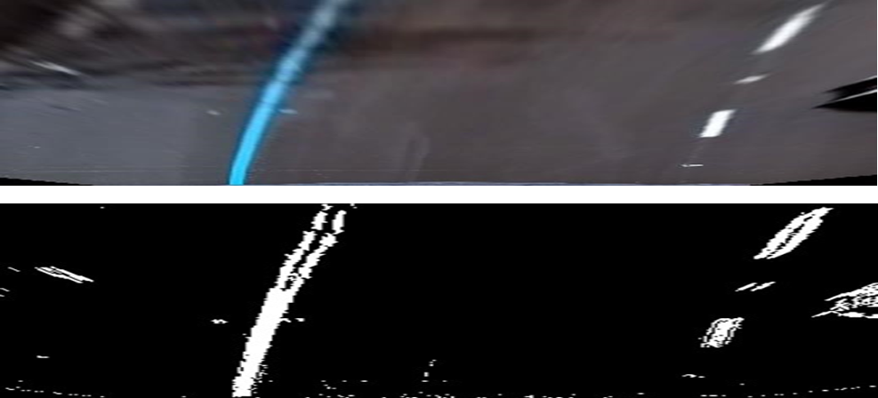
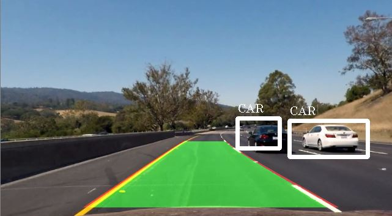

# Advanced Lane Finding Project and Yolo Objection Detection.     
### Distortion corrected calibration image.   
The code for this step is contained in the calibration.cpp [Here](../LaneandYolovehicle-Detection/calibration.cpp).  
Start by preparing "object points", which will be the (x, y, z) coordinates of the chessboard corners in the world. Here we are assuming the chessboard is fixed on the (x, y) plane at z=0, such that the object points are the same for each calibration image. Thus, objp is just a replicated array of coordinates, and objpoints will be appended with a copy of it every time I successfully detect all chessboard corners in a test image. imgpoints will be appended with the (x, y) pixel position of each of the corners in the image plane with each successful chessboard detection. Then use the output objpoints and imgpoints to compute the camera calibration and distortion coefficients using the calibrateCamera() function.  
Example:   
    
#### Pipeline.   
At First,  resize the image and then  convert frame as Bird view and then use a combination of color and gradient thresholds to generate a binary image.  
**Step 1:** Undisort Image.   
**Step 2:** Binary Image.   
**Step 3:** Take a histogram along all the columns in the lower half of the image and split histogram for two sides for each lane.   
**Step 4:** Use the two highest peaks from histogram as a starting point for determining where the lane lines are, and then use sliding windows moving upward in the image to determine where the lane lines go.   
Example: 
   
**Step 5:**  Identify lane-line pixels.    
Find all non zero pixels.  
Example:   
    
**Step 6:** Fit their positions with a polynomial.   
After performing 2nd order polynomial fit for nonzero pixels, drawing polyline and unwrap image the final output.  
Example:   
     
### Radius of curvature of the lane and the position of the vehicle with respect to center. 
Get the left and right cordinates and calculate the midpoint of lanes and use the image center as reference to calculate distance away from center.  
1-	LANEDETECTION::center_dist – Distance of Vechicle from center.  
2-	LANEDETECTION::left_curverad – Left Lane Curvature.  
3-	LANEDETECTION::right_curverad – Right Lane Curvature.  
## YOLO Object Detection.  
The Tensorflow Model is trained for five classes of objects: cars, pedestrians, truck, cyclists and traffic lights.  
Example:   
    

## Video Output.  
The Vidoe output can be found [Here]( https://github.com/apreddyy/LaneandYolovehicle-Detection/blob/master/out.avi).  
## Dependencies and Compiling.  
1-	Visual Studio 2015.  
2-	CUDA 9.0. For Windows installation Guide and Requirements [Here]( https://docs.nvidia.com/cuda/cuda-installation-guide-microsoft-windows/index.html#install-cuda-software).   
3-	TBB . For more information and installation [Here]( https://software.intel.com/en-us/intel-tbb).   
4-	Tensorflow 1.7.0. For Building a static Tensorflow C++ library on Windows [Here]( https://joe-antognini.github.io/machine-learning/build-windows-tf) and [Here]( https://medium.com/@shiweili/building-tensorflow-c-shared-library-on-windows-e79c90e23e6e).    
5-	OpenCV 3.4 or Greater. More information can be found [Here]( https://jamesbowley.co.uk/build-compile-opencv-3-4-in-windows-with-cuda-9-0-and-intel-mkl-tbb/).    
6-	Tensorflow trained model (graph-vehicledetection.pb) is included in repository.  

# Thanks

